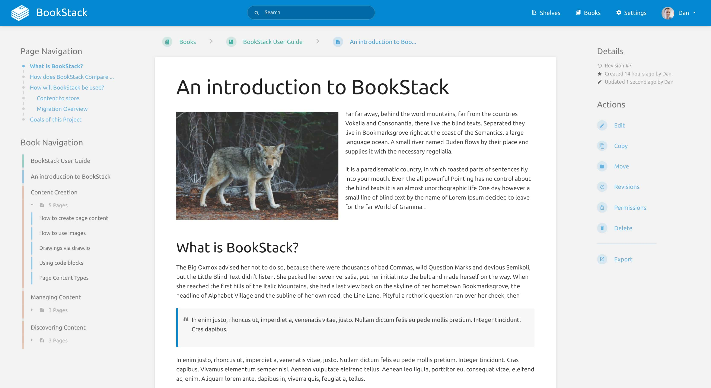

<!--
N.B.: This README was automatically generated by https://github.com/YunoHost/apps/tree/master/tools/README-generator
It shall NOT be edited by hand.
-->

# BookStack for YunoHost

[](https://dash.yunohost.org/appci/app/bookstack)    
[](https://install-app.yunohost.org/?app=bookstack)

*[Lire ce readme en français.](./README_fr.md)*

> *This package allows you to install BookStack quickly and simply on a YunoHost server.
If you don't have YunoHost, please consult [the guide](https://yunohost.org/#/install) to learn how to install it.*

## Overview

BookStack is an opinionated wiki system that provides a pleasant and simple out of the box experience. New users to an instance should find the experience intuitive and only basic word-processing skills should be required to get involved in creating content on BookStack. The platform should provide advanced power features to those that desire it but they should not interfere with the core simple user experience.

### Features

- Multi-Factor Authentication
- Dark & Light Modes
- LDAP Authentication
- Optional Markdown Editor
- Multi-Lingual


**Shipped version:** 22.03~ynh1

**Demo:** https://demo.bookstackapp.com

## Screenshots



## Disclaimers / important information

## Configuration

BookStack uses LDAP authentication by default.

You can switch to standard authentication in the webadmin -> bookstack -> config panel setting.

For the first time Login with standard authentication, use the default credentials `admin@admin.com` and `password`. You should change these details immediately after logging in for the first time.

## Documentation and resources

* Official app website: https://www.bookstackapp.com
* Official user documentation: https://www.bookstackapp.com/docs/user/
* Official admin documentation: https://www.bookstackapp.com/docs/admin/
* Upstream app code repository: https://github.com/BookStackApp/BookStack
* YunoHost documentation for this app: https://yunohost.org/app_bookstack
* Report a bug: https://github.com/YunoHost-Apps/bookstack_ynh/issues

## Developer info

Please send your pull request to the [testing branch](https://github.com/YunoHost-Apps/bookstack_ynh/tree/testing).

To try the testing branch, please proceed like that.
```
sudo yunohost app install https://github.com/YunoHost-Apps/bookstack_ynh/tree/testing --debug
or
sudo yunohost app upgrade bookstack -u https://github.com/YunoHost-Apps/bookstack_ynh/tree/testing --debug
```

**More info regarding app packaging:** https://yunohost.org/packaging_apps