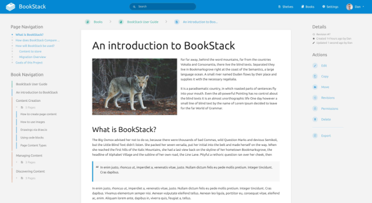

<!--
N.B.: This README was automatically generated by https://github.com/YunoHost/apps/tree/master/tools/README-generator
It shall NOT be edited by hand.
-->

# BookStack pour YunoHost

[](https://dash.yunohost.org/appci/app/bookstack)  

[](https://install-app.yunohost.org/?app=bookstack)

*[Read this readme in english.](./README.md)*

> *Ce package vous permet d’installer BookStack rapidement et simplement sur un serveur YunoHost.
Si vous n’avez pas YunoHost, regardez [ici](https://yunohost.org/#/install) pour savoir comment l’installer et en profiter.*

## Vue d’ensemble

BookStack est un système wiki simple prête à l'emploi. Les nouveaux utilisateurs d'une instance devraient trouver l'expérience intuitive et seules des compétences de base en traitement de texte devraient être requises pour s'impliquer dans la création de contenu sur BookStack. La plate-forme doit fournir des fonctionnalités avancées à ceux qui le souhaitent, mais elles ne doivent pas interférer avec l'expérience utilisateur simple de base.

### Caractéristiques

- Authentification multifacteur
- Modes sombre et clair
- Authentification LDAP
- Éditeur Markdown facultatif
- Multilingue


**Version incluse :** 23.06.2~ynh2

**Démo :** https://demo.bookstackapp.com

## Captures d’écran



## Documentations et ressources

* Site officiel de l’app : <https://www.bookstackapp.com>
* Documentation officielle utilisateur : <https://www.bookstackapp.com/docs/user/>
* Documentation officielle de l’admin : <https://www.bookstackapp.com/docs/admin/>
* Dépôt de code officiel de l’app : <https://github.com/BookStackApp/BookStack>
* Documentation YunoHost pour cette app : <https://yunohost.org/app_bookstack>
* Signaler un bug : <https://github.com/YunoHost-Apps/bookstack_ynh/issues>

## Informations pour les développeurs

Merci de faire vos pull request sur la [branche testing](https://github.com/YunoHost-Apps/bookstack_ynh/tree/testing).

Pour essayer la branche testing, procédez comme suit.

``` bash
sudo yunohost app install https://github.com/YunoHost-Apps/bookstack_ynh/tree/testing --debug
ou
sudo yunohost app upgrade bookstack -u https://github.com/YunoHost-Apps/bookstack_ynh/tree/testing --debug
```

**Plus d’infos sur le packaging d’applications :** <https://yunohost.org/packaging_apps>